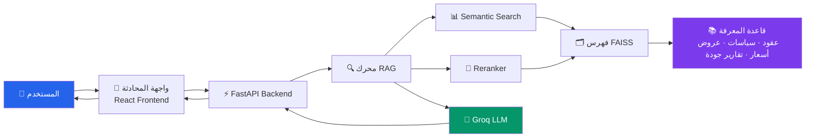

<div align="center">


<p>
نظام ذكاء اصطناعي متكامل لإدارة وتحليل بيانات المشتريات باستخدام تقنية <b>RAG (Retrieval-Augmented Generation)</b><br/>
يتيح البحث الذكي والتفاعل الطبيعي مع سياسات الشراء، العقود، عروض الأسعار، وتقارير الجودة
</p>

<p>


</p>

<p>


</p>

</div>

---

## 📑 جدول المحتويات

- [نظرة عامة](#-نظرة-عامة)
- [المميزات الرئيسية](#-المميزات-الرئيسية)
- [البنية التقنية](#️-البنية-التقنية)
- [مخطط تدفق العمل](#-مخطط-تدفق-العمل)
- [لقطات من النظام](#-لقطات-من-النظام)
- [التشغيل السريع](#-التشغيل-السريع)
- [الاختبارات](#-الاختبارات)
- [التوثيق](#-التوثيق)
- [فريق العمل](#-فريق-العمل)
- [الترخيص](#️-الترخيص)

---

## 📋 نظرة عامة

**ProcureMind-AI** هو مساعد ذكي مبني على معمارية RAG، مصمم لمساعدة فرق المشتريات على الوصول الفوري للمعلومات من قاعدة معرفة ضخمة تشمل:

- 📜 **سياسات الشراء وتقييم الموردين**
- 📄 **العقود مع الموردين**
- 💰 **عروض الأسعار (Quotations)**
- ✅ **تقارير الجودة**

بدلاً من البحث اليدوي في عشرات الملفات، يمكن للمستخدم طرح سؤال بلغة طبيعية والحصول على إجابة دقيقة مدعومة بالمصادر الفعلية.

---

## ✨ المميزات الرئيسية

| الميزة | الوصف |
|---|---|
| 🔍 **بحث دلالي (Semantic Search)** | فهم معنى السؤال وليس فقط الكلمات المفتاحية |
| 🔄 **إعادة الترتيب (Reranking)** | تحسين دقة النتائج المسترجعة قبل توليد الإجابة |
| 🧩 **تقسيم ذكي للنصوص (Chunking)** | معالجة المستندات الطويلة بكفاءة |
| 💬 **واجهة محادثة تفاعلية** | مبنية بـ React لتجربة مستخدم سلسة |
| 📌 **عرض المصادر** | كل إجابة مرفقة بالمستند الذي استُخرجت منه |
| 🐳 **جاهز للنشر عبر Docker** | تشغيل موحّد للـ Backend والـ Frontend |
| ⚙️ **CI/CD تلقائي** | عبر GitHub Actions للاختبار والنشر |

---

## 🏗️ البنية التقنية

```
ProcureMind-AI/
├── backend/          # خادم FastAPI + محرك RAG
├── frontend/          # واجهة React
├── knowledge_base/   # قاعدة المعرفة (عقود، سياسات، عروض أسعار، تقارير جودة)
├── faiss_index/       # فهرس FAISS للبحث المتجهي
├── data/              # بيانات التشغيل (uploads, cache, logs, backups)
├── scripts/           # سكريبتات بناء وصيانة الفهرس
├── docs/               # التوثيق الفني الكامل
└── docker/            # إعدادات النشر
```

للتفاصيل الكاملة، راجع [Architecture.md](docs/Architecture.md).

---

## 🔄 مخطط تدفق العمل



---

## 📸 لقطات من النظام

<div align="center">

| واجهة المحادثة | عرض المصادر | لوحة النتائج |
|:---:|:---:|:---:|
|  |  |  |

</div>

> 💡 ضع لقطات الشاشة الفعلية داخل `docs/screenshots/` بنفس الأسماء أعلاه ليتم عرضها تلقائيًا هنا.

---

## 🚀 التشغيل السريع

### المتطلبات الأساسية
- Python 3.10+
- Node.js 18+
- مفتاح Groq API ([احصل عليه من هنا](https://console.groq.com/keys))

### 1. استنساخ المشروع
```bash
git clone https://github.com/gemad2605-web/ProcureMind-AI.git
cd ProcureMind-AI
```

### 2. إعداد متغيرات البيئة
```bash
cp backend/.env.example backend/.env
```
ثم أضف مفتاح Groq API الخاص بك داخل `backend/.env`:
```
GROQ_API_KEY=your_groq_api_key_here
```

> ⚠️ **لا تشارك ملف `.env` أو مفتاحك مع أي شخص أو ترفعه على GitHub.**

### 3. تشغيل الـ Backend
```bash
cd backend
pip install -r requirements.txt
python main.py
```

### 4. تشغيل الـ Frontend
```bash
cd frontend
npm install
npm run dev
```

### أو باستخدام Docker
```bash
docker-compose -f docker/docker-compose.yml up
```

---

## 🧪 الاختبارات

```bash
cd backend
pytest tests/
```

---

## 📚 التوثيق

| المستند | الوصف |
|---|---|
| [API Documentation](docs/API_Documentation.md) | توثيق شامل لنقاط النهاية (Endpoints) |
| [Architecture](docs/Architecture.md) | شرح معماري النظام بالتفصيل |
| [Deployment Guide](docs/Deployment_Guide.md) | دليل خطوات النشر |
| [User Manual](docs/User_Manual.md) | دليل استخدام النظام للمستخدم النهائي |

---

## 👥 فريق العمل

<div align="center">
<table>
  <tr>
    <td align="center" width="200">
      <br/>
      <b>Goda Emad</b><br>
      <sub>🧠 Data Analyst & AI Developer</sub><br/>
      <a href="https://github.com/Goda-Emad"></a>
    </td>
    <td align="center" width="200">
      <br/>
      <b>Gana Emad</b><br>
      <sub>👩‍💻 Team Member</sub>
    </td>
    <td align="center" width="200">
      <br/>
      <b>Manar Harby</b><br>
      <sub>👩‍💻 Team Member</sub>
    </td>
  </tr>
</table>
</div>

---

## 🛡️ الترخيص

هذا المشروع مرخّص بموجب [MIT License](LICENSE).

---

## 🤝 المساهمة

المساهمات مرحّب بها! يُرجى فتح Issue أو Pull Request لأي تحسينات أو إصلاحات.

---

<div align="center">

<p>صُنع بـ ❤️ لتحسين كفاءة إدارة المشتريات بالذكاء الاصطناعي</p>
</div>
